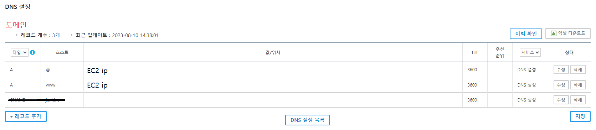

# “k-pop에 필요한 모든 만남이 있는 곳” Step Up 


👉 [기능 소개](https://cypress-nigella-d2a.notion.site/2971539abcde4505973e4a14e6458b61?pvs=4)

👉 [배포 관련 자세한 내용 참조](https://www.notion.so/36653d0fff1a40d2aac3d80beed99200?pvs=21)


**[ 개발 환경 ]**

```
VS Code : 1.81.1
IntelliJ : 17.0.7+10-b829.16 amd64
spring boot : 2.7.13
JDK : OpenJDK 11.0.18
JVM : JDK와 동일
next.js : 13.4.10
Node.js : 18.16.1
socket.io : ^4.7.1
```

**[ DB ]**

```
mariaDB : 15.1 Distrib 10.5.10-MariaDB
redis : 7.0.12
mongoDB : 6.0.9
```

**[ 서버 환경 ]**

```
EC2 - ami linux 2 (t2 micro, 프리티어)
nginx : 1.22.1
ssl
docker : 20.10.23
~~jenkins - dood~~
```

**[ 외부 서비스 ]**

```
AWS S3
Gmail
```


## 초기 세팅 (EC2 접속)

### git clone

```bash
git clone https://lab.ssafy.com/s09-webmobile1-sub2/S09P12A601.git
```


### mariaDB 실행

```bash
# mariaDB 이미지 받기
docker pull mariadb:latest

# mariaDB 실행
docker run --name mariadb -d -p 3306:3306 mariadb:latest
```


### redis 실행

```bash
# redis image
docker pull redis

# run redis
docker run -d -p 6379:6379 --name redis redis:latest --requirepass "비밀번호"
```


### mongoDB 실행

mongoDB docker-compose 작성

```bash
mkdir mongoDB
cd mongoDB
vim docker-compose.yml

# ======= vim 편집기 docker-compose 작성 ======
version: '3.0'
services:
  mongodb:
    image: mongo
    # 컨테이너 실행시 재시작
    restart: always
    # 컨테이너명
    container_name: mongodb
    # 포트번호 설정
    ports:
      - "27017:27017"
    command: [--auth]
    environment:
      MONGO_INITDB_ROOT_USERNAME: 사용자 이름
      MONGO_INITDB_ROOT_PASSWORD: 비밀번호
    volumes:
      - ./data/mongodb:/data/db
```

mongoDB 실행

```bash
cd mongoDB
docker-compose up -d
```


### nginx 설정 및 SSL 적용

도메인 적용



Let’s Encrypt 설치

```bash
sudo wget -r --no-parent -A 'epel-release-*.rpm' <http://dl.fedoraproject.org/pub/epel/7/x86_64/Packages/e/>

sudo rpm -Uvh dl.fedoraproject.org/pub/epel/7/x86_64/Packages/e/epel-release-*.rpm

sudo yum-config-manager --enable epel*

# cerbot 설치
sudo yum install -y certbot python2-certbot-apache
sudo yum install certbot-nginx
```

Nginx 설치 및 실행

```bash
# nginx 설치
sudo yum install nginx

# nginx 실행
sudo service nginx start
```

Nginx 설정 파일 작성

```bash
vim conf.d/default.conf

# ===== vim 편집기 default.conf 작성 =====
upstream frontend {
	server 127.0.0.1:3000;
}
upstream backend {
	server 127.0.0.1:8080;
}
upstream socket {
	server 127.0.0.1:4002;
}

server {
	listen 80;
	server_name 서버 주소;
	location / {
		return 301 도메인주소$request_uri;
	}
}

server {
	listen 443 ssl;
    	ssl_certificate /etc/letsencrypt/live/도메인주소/fullchain.pem;
	   	ssl_certificate_key /etc/letsencrypt/live/도메인주소/privkey.pem;
    	include /etc/letsencrypt/options-ssl-nginx.conf;
    	ssl_dhparam /etc/letsencrypt/ssl-dhparams.pem;

	server_name 도메인주소
	location /api {
		rewrite ^/api(/.*)$ $1 break;
		proxy_pass <http://backend>;
		proxy_http_version 1.1;
		proxy_set_header Upgrade $http_upgrade;
		proxy_set_header Connection "upgrade";
		proxy_set_header Host $host;
		proxy_set_header X-Real-IP $remote_addr;
		proxy_set_header X-Forwarded-For $proxy_add_x_forwarded_for;
		proxy_set_header X-Forwarded-Proto $scheme;
	}

	location / {
		proxy_pass <http://frontend>;
		proxy_set_header Host $host;
		proxy_set_header X-Real-IP $remote_addr;
		proxy_set_header X-Forwarded-For $proxy_add_x_forwarded_for;
		proxy_set_header X-Forwarded-Proto $scheme;
		 # https websocket
            	proxy_set_header       Upgrade $http_upgrade;
           	proxy_set_header       Connection "upgrade";        	
	}
}

server {
    if ($host = 도메인주소) { 
        return 301 https://$host$request_uri;
    }

    if ($host = 도메인주소) {
        return 301 https://$host$request_uri;
    }
}
```

Let’s Encrypt 적용

```bash
sudo certbot --nginx
```


## 프로젝트 배포

### SpringBoot 배포

SpringBoot Docker image Build

```bash
cd S09P12A601/backend

docker build -t 도커허브아이디/stepup-spring .
```

SpringBoot 실행

```bash
docker run --name stepup-spring -d -p 8080:8080 stepup-spring
```


### Socket 배포

Socket Docker image Build

```bash
cd S09P12A601/socket

docker build -t 도커허브아이디/stepup-socket .
```

Socket 실행

```bash
# -v : ec2 서버의 /etc/letsencrypt 디렉토리와 
			# stepup-socket-test 컨테이너의 /app/ssl 디렉토리 연결
docker run -d --name stepup-socket -p 4002:4002 \\
 -v /etc/letsencrypt:/app/ssl 도커허브아이디/stepup-socket
```


### Next.js 배포

Next.js Docker image Build

```bash
cd S09P12A601/front

docker build -t 도커허브아이디/stepup-next .
```

Next.js 실행

```bash
docker run --name stepup-next -d -p 3000:3000 stepup-next
```


