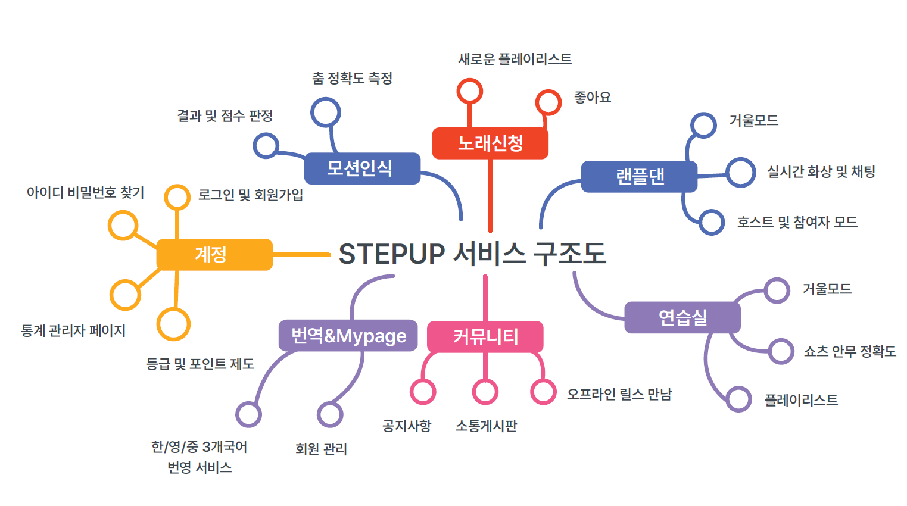
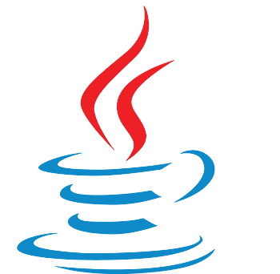
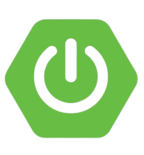
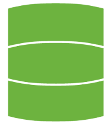
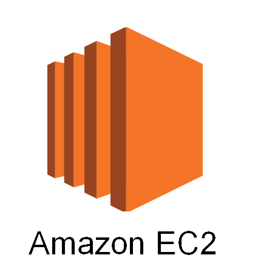
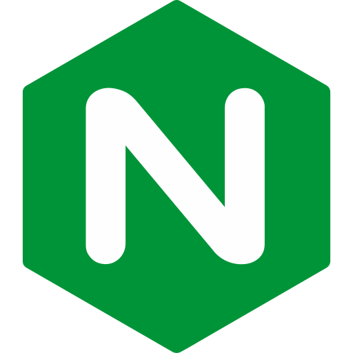
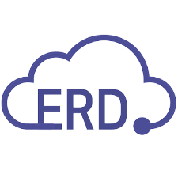
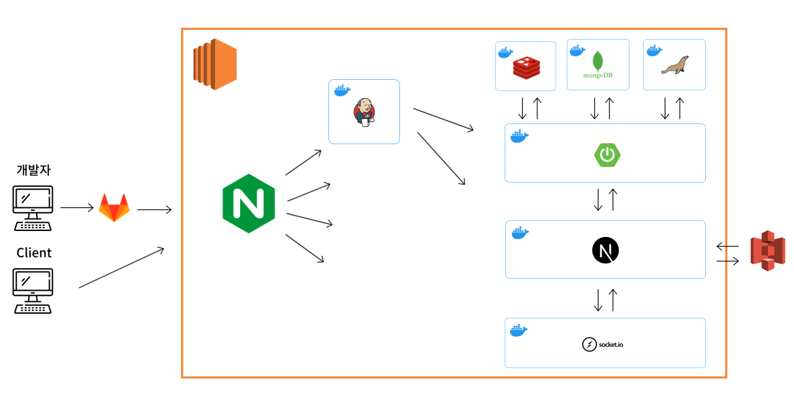

# “k-pop에 필요한 모든 만남이 있는 곳” Step Up 

 

## 기능 소개

👉 [기능 소개](https://cypress-nigella-d2a.notion.site/2971539abcde4505973e4a14e6458b61?pvs=4)

 

## 서비스 구조

 

## 사용 기술

### 🚀 Stacks

**[Frontend]**

 **SCSS**

 **Typescript**

 **Next.js**

 **Recoil**

 **Socket.io**

 

**[Backend]**

 **Java**

 **Spring Boot**

 **Spring Security**

 **JPA**

 

**[DB]**

 **MariaDB**

 **Redis**

 **MongoDB**

 

**[Motion Detect]**

 **Media Pipe**

 

### 🛠  Infra & Tools

 **EC2**

 **S3** 

 **Docker** 

 **Nginx** 

 **Let’s Encrypt (SSL)** 

 **Jenkins** 

 **Git** 

 **Figma** 

 **Miro** 

 **ERD Cloud** 

 **MobaXTerm** 

 **Postman** 

 

### 👥  Collaboration

 **GitLab** 

 **Notion** 

 **Jira** 

 **Discord** 

 **MatterMost** 

 **Webex** 

 

## 서버 **아키텍처**

 

## 멤버

| :crown: 장세범                                               | 송채은                                                       | 이가경                                                       |
| ------------------------------------------------------------ | ------------------------------------------------------------ | ------------------------------------------------------------ |
|   ⭐ 팀장 📞 010-6569-7740 ✉️ j3beom@gmail.com 📁 [Sehbeom.git](https://github.com/Sehbeom) 📄 [3Beom.log ](https://velog.io/@j3beom)🏷️ #ENFP #BE  |   ⭐ 서기 📞 010-7102-9842 ✉️ sce9842@gmail.com 📁 [SongChaee ](https://github.com/SongChaee)🏷️ #ENFP #FE  |   ⭐ 서기 📞 010-3892-6597 ✉️ rabbit1999k@naver.com 📁  [rabbit0216](https://github.com/rabbit0216) 🏷️  #INTP #BE #인프라  |

| 이슬기                                                       | 이주희                                                       | 최찬영                                                       |
| ------------------------------------------------------------ | ------------------------------------------------------------ | ------------------------------------------------------------ |
|   ⭐ 컨텐츠 📞 010-7682-5051 ✉️ urina842@gmail.com 📁 [seul1219 ](https://github.com/seul1219)🏷️ #INTJ #BE  |   ⭐ 총무 📞 010-7240-8563 ✉️ joo9837@naver.com 📁 [ejoohee](https://github.com/ejoohee) 🏷️ #ESFP #BE  |   ⭐ 디자인 📞 010-7748-9292 ✉️ cy9803@gmail.com 📁 [livinoid98](https://github.com/livinoid98) 🏷️ #FE  |
